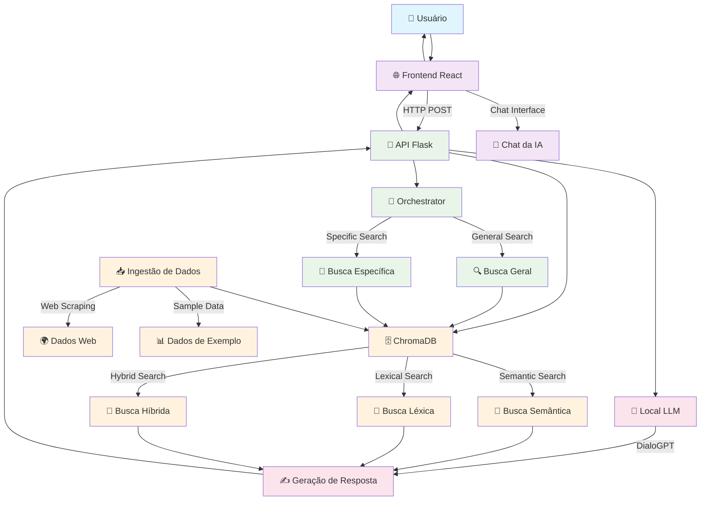

# Arquitetura do Sistema Academ.ia

## Visão Geral

O Academ.ia é um sistema de RAG (Retrieval-Augmented Generation) que combina busca semântica com geração de respostas usando IA para o Portal de Periódicos da CAPES.

## Diagrama de Arquitetura



## Componentes do Sistema

### 🎨 **Frontend (React)**
- **Interface do Usuário**: Design baseado no Portal de Periódicos da CAPES
- **Chat da IA**: Modal interativo para conversação
- **Responsividade**: Adaptável a diferentes dispositivos
- **Tecnologias**: React, Bootstrap, Font Awesome

### 🔌 **API (Flask)**
- **Endpoint Principal**: `/rag` - Processa consultas e gera respostas
- **Orchestrator**: Determina o tipo de busca baseado na query
- **CORS**: Configurado para comunicação com frontend
- **Tecnologias**: Flask, Flask-CORS

### 🗄️ **Vector Store (ChromaDB)**
- **Busca Semântica**: Usando embeddings do Sentence Transformers
- **Busca Léxica**: Filtros por metadados
- **Busca Híbrida**: Combinação de semântica + léxica
- **Persistência**: Dados salvos localmente
- **Tecnologias**: ChromaDB, Sentence Transformers

### 🤖 **Local LLM (DialoGPT)**
- **Modelo**: Microsoft DialoGPT-medium
- **Geração**: Respostas baseadas em contexto
- **Processamento**: Local (sem dependências externas)
- **Tecnologias**: Transformers, PyTorch

### 📥 **Ingestão de Dados**
- **Web Scraping**: Extração de artigos do CAPES
- **Processamento**: Divisão em chunks e geração de embeddings
- **Indexação**: Armazenamento no ChromaDB
- **Tecnologias**: BeautifulSoup, LangChain

## Fluxo de Dados

### 1. **Consulta do Usuário**
```
Usuário → Frontend → API Flask
```

### 2. **Orquestração**
```
API → Orchestrator → Tipo de Busca
```

### 3. **Busca de Documentos**
```
Orchestrator → ChromaDB → Resultados
```

### 4. **Geração de Resposta**
```
Resultados → Local LLM → Resposta
```

### 5. **Retorno**
```
Resposta → API → Frontend → Usuário
```

## Tipos de Busca

### 🔍 **Busca Geral**
- **Trigger**: Palavras-chave gerais
- **Processo**: Busca em todos os documentos
- **Resultado**: Artigos relevantes

### 📄 **Busca Específica**
- **Trigger**: "no artigo X" ou "do documento Y"
- **Processo**: Filtro por nome do documento
- **Resultado**: Conteúdo específico

### 🧠 **Busca Semântica**
- **Método**: Embeddings vetoriais
- **Vantagem**: Encontra similaridades conceituais
- **Uso**: Quando busca léxica não é suficiente

### 📝 **Busca Léxica**
- **Método**: Correspondência exata de palavras
- **Vantagem**: Precisão para termos específicos
- **Uso**: Busca por nomes, títulos, autores

### 🔄 **Busca Híbrida**
- **Método**: Combinação de semântica + léxica
- **Vantagem**: Melhor cobertura e precisão
- **Uso**: Padrão para a maioria das consultas

## Tecnologias Utilizadas

### **Frontend**
- React 18.3.1
- Bootstrap 5.3.3
- Font Awesome
- Axios

### **Backend**
- Flask
- Flask-CORS
- ChromaDB
- Sentence Transformers
- Transformers (DialoGPT)
- PyTorch

### **Ingestão**
- BeautifulSoup
- LangChain
- Requests

### **Infraestrutura**
- Python 3.9+
- Node.js 16+
- SQLite (ChromaDB)

## Considerações de Performance

### **Otimizações Implementadas**
- **Chunking**: Documentos divididos em pedaços de 500 tokens
- **Embeddings**: Modelo otimizado (all-MiniLM-L6-v2)
- **Cache**: ChromaDB com persistência local
- **Truncation**: Limitação de entrada para evitar overflow

### **Limitações Atuais**
- **Modelo Local**: DialoGPT pode ser lento em hardware limitado
- **Memória**: ChromaDB carregado em memória
- **Escalabilidade**: Limitada pelo processamento local

## Segurança

### **Medidas Implementadas**
- **CORS**: Configurado para domínios específicos
- **Validação**: Verificação de entrada do usuário
- **Sanitização**: Limpeza de dados HTML
- **Local**: Processamento local sem envio de dados externos

### **Privacidade**
- **Dados Locais**: Nenhum dado enviado para APIs externas
- **Modelo Local**: DialoGPT roda completamente local
- **Controle**: Usuário tem controle total sobre os dados

## Deploy e Infraestrutura

### **Opções de Hospedagem**
- **Vercel**: Frontend + Backend (Serverless)
- **Render**: Web Services + Static Sites
- **Railway**: Full-stack deployment
- **Netlify**: Frontend + Serverless Functions

### **Requisitos Mínimos**
- **RAM**: 2GB (para modelos de IA)
- **Storage**: 1GB (para ChromaDB)
- **CPU**: 2 cores (para processamento)

---

*Este diagrama representa a arquitetura atual do sistema Academ.ia, que pode evoluir conforme novas funcionalidades são implementadas.* 