# Academ.ia System Architecture

## Overview

Academ.ia is a RAG (Retrieval-Augmented Generation) system that combines semantic search with AI response generation for the CAPES Periodicals Portal.

## Architecture Diagram

```mermaid
graph TB
    %% User
    User[👤 User] --> Frontend[🌐 React Frontend]
    
    %% Frontend
    Frontend --> |HTTP POST| API[🔌 Flask API]
    Frontend --> |Chat Interface| ChatUI[💬 AI Chat]
    
    %% Backend
    API --> Orchestrator[🎯 Orchestrator]
    API --> VectorStore[🗄️ ChromaDB]
    API --> LLM[🤖 Local LLM]
    
    %% Orchestrator
    Orchestrator --> |General Search| GeneralSearch[🔍 General Search]
    Orchestrator --> |Specific Search| SpecificSearch[📄 Specific Search]
    
    %% Vector Store
    VectorStore --> |Semantic Search| SemanticSearch[🧠 Semantic Search]
    VectorStore --> |Lexical Search| LexicalSearch[📝 Lexical Search]
    VectorStore --> |Hybrid Search| HybridSearch[🔄 Hybrid Search]
    
    %% LLM
    LLM --> |DialoGPT| ResponseGen[✍️ Response Generation]
    
    %% Data Flow
    GeneralSearch --> VectorStore
    SpecificSearch --> VectorStore
    SemanticSearch --> ResponseGen
    LexicalSearch --> ResponseGen
    HybridSearch --> ResponseGen
    
    %% Response
    ResponseGen --> API
    API --> Frontend
    Frontend --> User
    
    %% Data Ingestion
    DataIngestion[📥 Data Ingestion] --> VectorStore
    DataIngestion --> |Web Scraping| WebData[🌍 Web Data]
    DataIngestion --> |Sample Data| SampleData[📊 Sample Data]
    
    %% Styling
    classDef userClass fill:#e1f5fe
    classDef frontendClass fill:#f3e5f5
    classDef backendClass fill:#e8f5e8
    classDef dataClass fill:#fff3e0
    classDef aiClass fill:#fce4ec
    
    class User userClass
    class Frontend,ChatUI frontendClass
    class API,Orchestrator,GeneralSearch,SpecificSearch backendClass
    class VectorStore,SemanticSearch,LexicalSearch,HybridSearch,DataIngestion,WebData,SampleData dataClass
    class LLM,ResponseGen aiClass
```



## System Components

### 🎨 **Frontend (React)**
- **User Interface**: Design based on the CAPES Periodicals Portal
- **AI Chat**: Interactive modal for conversation
- **Responsiveness**: Adaptable to different devices
- **Technologies**: React, Bootstrap, Font Awesome

### 🔌 **API (Flask)**
- **Main Endpoint**: `/rag` - Processes queries and generates responses
- **Orchestrator**: Determines search type based on query
- **CORS**: Configured for frontend communication
- **Technologies**: Flask, Flask-CORS

### 🗄️ **Vector Store (ChromaDB)**
- **Semantic Search**: Using Sentence Transformers embeddings
- **Lexical Search**: Metadata filters
- **Hybrid Search**: Combination of semantic + lexical
- **Persistence**: Data saved locally
- **Technologies**: ChromaDB, Sentence Transformers

### 🤖 **Local LLM (DialoGPT)**
- **Model**: Microsoft DialoGPT-medium
- **Generation**: Context-based responses
- **Processing**: Local (no external dependencies)
- **Technologies**: Transformers, PyTorch

### 📥 **Data Ingestion**
- **Web Scraping**: Article extraction from CAPES
- **Processing**: Chunking and embedding generation
- **Indexing**: Storage in ChromaDB
- **Technologies**: BeautifulSoup, LangChain

## Data Flow

### 1. **User Query**
```
User → Frontend → Flask API
```

### 2. **Orchestration**
```
API → Orchestrator → Search Type
```

### 3. **Document Search**
```
Orchestrator → ChromaDB → Results
```

### 4. **Response Generation**
```
Results → Local LLM → Response
```

### 5. **Return**
```
Response → API → Frontend → User
```

## Search Types

### 🔍 **General Search**
- **Trigger**: General keywords
- **Process**: Search in all documents
- **Result**: Relevant articles

### 📄 **Specific Search**
- **Trigger**: "in article X" or "from document Y"
- **Process**: Filter by document name
- **Result**: Specific content

### 🧠 **Semantic Search**
- **Method**: Vector embeddings
- **Advantage**: Finds conceptual similarities
- **Use**: When lexical search is insufficient

### 📝 **Lexical Search**
- **Method**: Exact word matching
- **Advantage**: Precision for specific terms
- **Use**: Search for names, titles, authors

### 🔄 **Hybrid Search**
- **Method**: Combination of semantic + lexical
- **Advantage**: Better coverage and precision
- **Use**: Default for most queries

## Technologies Used

### **Frontend**
- React 18.3.1
- Bootstrap 5.3.3
- Font Awesome
- Axios

### **Backend**
- Flask
- Flask-CORS
- ChromaDB
- Sentence Transformers
- Transformers (DialoGPT)
- PyTorch

### **Ingestion**
- BeautifulSoup
- LangChain
- Requests

### **Infrastructure**
- Python 3.9+
- Node.js 16+
- SQLite (ChromaDB)

## Performance Considerations

### **Implemented Optimizations**
- **Chunking**: Documents divided into 500-token chunks
- **Embeddings**: Optimized model (all-MiniLM-L6-v2)
- **Cache**: ChromaDB with local persistence
- **Truncation**: Input limitation to prevent overflow

### **Current Limitations**
- **Local Model**: DialoGPT can be slow on limited hardware
- **Memory**: ChromaDB loaded in memory
- **Scalability**: Limited by local processing

## Security

### **Implemented Measures**
- **CORS**: Configured for specific domains
- **Validation**: User input verification
- **Sanitization**: HTML data cleaning
- **Local**: Local processing without external data transmission

### **Privacy**
- **Local Data**: No data sent to external APIs
- **Local Model**: DialoGPT runs completely locally
- **Control**: User has full control over data

## Deployment and Infrastructure

### **Hosting Options**
- **Vercel**: Frontend + Backend (Serverless)
- **Render**: Web Services + Static Sites
- **Railway**: Full-stack deployment
- **Netlify**: Frontend + Serverless Functions

### **Minimum Requirements**
- **RAM**: 2GB (for AI models)
- **Storage**: 1GB (for ChromaDB)
- **CPU**: 2 cores (for processing)

---

*This diagram represents the current architecture of the Academ.ia system, which may evolve as new features are implemented.* 