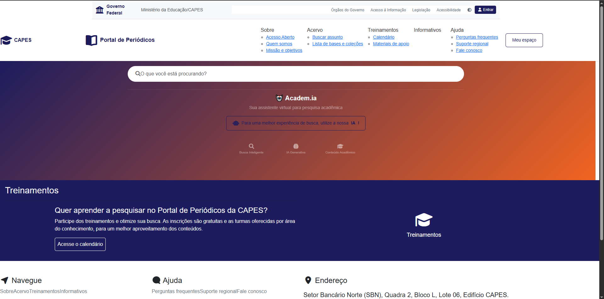
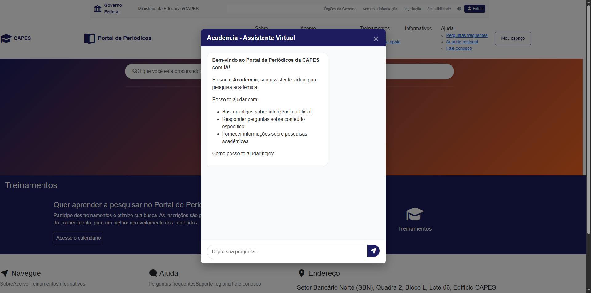

# Academ.ia - CAPES Periodicals Portal with AI

<div align="center">
  
  
</div>

<div align="center">
  <h3>🤖 Intelligent Search System for CAPES Periodicals Portal</h3>
  <p><strong>Integrating Generative AI with Semantic Search in Academic Documents</strong></p>
  
  [](https://www.python.org/)
  [](https://reactjs.org/)
  [](https://flask.palletsprojects.com/)
  [](https://www.trychroma.com/)
  [](https://huggingface.co/microsoft/DialoGPT-medium)
</div>

---

## 🚀 Features

- **🌐 Web Interface**: Design based on CAPES Periodicals Portal
- **🤖 AI Chat**: Virtual assistant for academic research
- **🧠 Semantic Search**: Uses ChromaDB for intelligent search
- **🔍 RAG (Retrieval-Augmented Generation)**: Combines document search with response generation
- **🏠 Local Model**: Uses DialoGPT for response generation

## 🏗️ Architecture

### 📁 File Structure
```
academIA/
├── rag_backend/           # Flask Backend + ChromaDB
│   ├── app.py            # Flask API
│   ├── models/           # AI and vector models
│   │   ├── chroma_vector_store.py
│   │   └── generate_local.py
│   └── requirements.txt  # Python dependencies
├── rag_frontend/         # React Frontend
│   ├── src/
│   │   ├── App.js        # Main interface
│   │   └── App.css       # CAPES-based styles
│   └── package.json      # Node.js dependencies
└── ingestion_module/     # Data ingestion scripts
    └── ingest.py         # ChromaDB ingestion
```

### 🔄 Architecture Diagram
For a detailed view of the system architecture, see the [**Architecture Diagram**](./ARCHITECTURE.md).

**Main Components:**
- **React Frontend**: Interface based on the CAPES Periodicals Portal
- **Flask API**: Backend with search orchestration
- **ChromaDB**: Vector database for semantic search
- **DialoGPT**: Local AI model for response generation
- **Ingestion**: Data processing and indexing system

## 🛠️ Technologies

### Backend
- **Flask**: REST API
- **ChromaDB**: Vector database
- **Sentence Transformers**: Embeddings for semantic search
- **DialoGPT**: Local language model
- **Transformers**: AI models library

### Frontend
- **React**: User interface
- **Bootstrap**: CSS framework
- **Font Awesome**: Icons
- **Axios**: HTTP client

## 📦 Installation

### 1. Backend

```bash
cd rag_backend
python -m venv venv
source venv/bin/activate  # Linux/Mac
# or
venv\Scripts\activate     # Windows

pip install -r requirements.txt
```

### 2. Frontend

```bash
cd rag_frontend
npm install
```

## 🚀 Execution

### 1. Start Backend

```bash
cd rag_backend
python app.py
```

The backend will be available at: `http://127.0.0.1:5000`

### 2. Start Frontend

```bash
cd rag_frontend
npm start
```

The frontend will be available at: `http://localhost:3000`

### 3. Ingest Data (Optional)

```bash
python ingestion_module/ingest.py
```

## 🎯 How to Use

1. **Access the interface**: Open `http://localhost:3000`
2. **Click the AI button**: "For a better search experience, use our AI!"
3. **Ask questions**: 
   - General questions: "What are the articles about Artificial Intelligence?"
   - Specific questions: "In article X, what are the main conclusions?"

## 🔧 Configuration

### Environment Variables

```bash
# Backend
BACKEND_URL=http://127.0.0.1:5000

# ChromaDB
CHROMA_DB_PATH=./chroma_db
```

### AI Models

The system uses:
- **Sentence Transformers**: `all-MiniLM-L6-v2` (for embeddings)
- **DialoGPT**: `microsoft/DialoGPT-medium` (for generation)

## 📊 AI Features

### Search Types
- **Semantic Search**: Finds similar documents
- **Hybrid Search**: Combines semantic + lexical
- **Specific Search**: Focuses on a specific document

### Capabilities
- ✅ Search in academic articles
- ✅ Context-based responses
- ✅ Familiar CAPES interface
- ✅ Interactive chat
- ✅ Keyword search

## 🎨 Interface

<div align="center">
  <h4>🖥️ Main Interface - CAPES Periodicals Portal</h4>
  <p><em>Official CAPES Periodicals Portal design with AI integration</em></p>
</div>

The interface was based on the official design of the CAPES Periodicals Portal, including:

- **🏛️ Government Header**: Standard gov.br bar
- **🎓 CAPES Logo**: Official visual identity
- **🎨 Institutional Colors**: Blue (#1c1c5c) and orange (#f16421)
- **📱 Responsive Layout**: Works on desktop and mobile
- **🤖 AI Chat Modal**: Integrated AI interface

### 🎯 Visual Characteristics

- **Familiar Design**: Interface identical to the official CAPES Portal
- **Seamless Integration**: AI integrated without breaking user experience
- **Accessibility**: Following web accessibility standards
- **Performance**: Fast loading and responsive

## 🔍 Usage Examples

### General Questions
```
"Quais artigos falam sobre machine learning?"
"Mostre artigos sobre inteligência artificial na educação"
"Quais são as tendências em IA?"
```

### Specific Questions
```
"No artigo 'Inteligência Artificial na Educação', quais são as principais conclusões?"
"Quais metodologias são mencionadas no artigo sobre machine learning?"
```

## 🔄 Data Flow

### 1. **User Query**
```
User → React Frontend → Flask API
```

### 2. **Orchestration**
```
API → Orchestrator → Search Type (General/Specific)
```

### 3. **Document Search**
```
Orchestrator → ChromaDB → Relevant Results
```

### 4. **Response Generation**
```
Results → DialoGPT → Contextualized Response
```

### 5. **Return**
```
Response → API → Frontend → User
```

## 🐛 Troubleshooting

### Backend Connection Error
- Check if Flask is running on port 5000
- Confirm CORS is enabled

### ChromaDB Error
- Check if the `chroma_db` directory exists
- Run the ingestion script again

### AI Model Error
- Check if dependencies are installed
- Confirm there's enough disk space

## 📝 License

This project is an educational prototype based on the CAPES Periodicals Portal.

## 🤝 Contribution

1. Fork the project
2. Create a branch for your feature (`git checkout -b feature/AmazingFeature`)
3. Commit your changes (`git commit -m 'Add some AmazingFeature'`)
4. Push to the branch (`git push origin feature/AmazingFeature`)
5. Open a Pull Request

## 📞 Support

- **📧 Email**: [romariodelima@hotmail.com]
- **🐛 Issues**: [GitHub Issues](https://github.com/your-username/academIA/issues)
---

<div align="center">
  <h3>🎓 Developed with ❤️ for the Brazilian academic community</h3>
  <p><em>Innovating academic research with Artificial Intelligence</em></p>
</div> 
